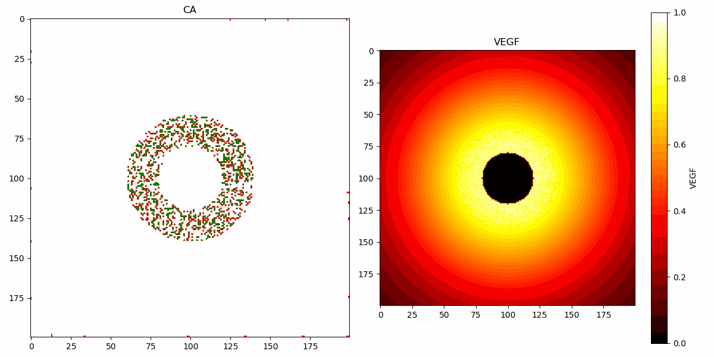

# Tumor Angiogenesis Simulation and Analysis

This project implements a cellular automaton (CA) model to simulate tumor angiogenesis, along with tools for analyzing the resulting data. The project includes modules for simulating tumor growth and blood vessel formation, performing network analyses, and visualizing the results. This implementation and project was inspired by the model found in Peña et al. (2024). 



## References
- A. Niemistö, V. Dunmire, O. Yli-Harja, W. Zhang, and I. Shmulevich, “Analysis of angiogenesis usingin vitroexperiments and stochastic growth models,” Physical Review E, vol. 72, no. 6. American Physical Society (APS), Dec. 16, 2005. doi: 10.1103/physreve.72.062902.

- J. U. Legaria-Peña, F. Sánchez-Morales, and Y. Cortés-Poza, “Understanding post-angiogenic tumor growth: Insights from vascular network properties in cellular automata modeling,” Chaos, Solitons &amp; Fractals, vol. 186. Elsevier BV, p. 115199, Sep. 2024. doi: 10.1016/j.chaos.2024.115199.

- V. Fleury and L. Schwartz, “Diffusion Limited Aggregation from Shear Stress as a Simple Model of Vasculogenesis,” Fractals, vol. 07, no. 01. World Scientific Pub Co Pte Lt, pp. 33–39, Mar. 1999. doi: 10.1142/s0218348x99000050.
---

## Features

1. **Simulation of Tumor Angiogenesis**  
   - Cellular automaton-based model incorporating blood vessel growth and tumor cell proliferation/death.
   - VEGF-driven stochastic angiogenesis.
   - Tumor entropy and clustering analysis.

2. **Network Analysis**  
   - Converts skeletonized images of vascular structures into graph representations.
   - Computes network metrics such as:
     - Average degree
     - Betweenness centrality
     - Page Rank
     - Clustering coefficient

4. **Visualization Tools**  
   - Animated histograms of tumor cluster sizes.
   - Distribution plots with fitted power-law curves.
   - Network metric visualizations against experimental parameters.

---

## Installation

### Requirements
- Python 3.8+
- Libraries:
  - `numpy`
  - `matplotlib`
  - `scikit-image`
  - `pandas`
  - `networkx`
  - `powerlaw`
  - `scipy`
  - `numba`
  - `skan`
  - `os`
  - `scipy`
  - `json`

Install dependencies via pip:
```bash
pip install numpy matplotlib scikit-image pandas networkx powerlaw scipy numba skan os scipy json
```

---

## Usage

### 1. **Simulating Tumor Angiogenesis**
Run the `tumor.py` script to simulate angiogenesis:
```bash
python3 tumor.py
```
Parameters include:
- `initialize_seeds`: Generates a list of seeds evenly distributed along the four edges. Order is left, right, top, bottom.
- `initialize_background`: Initialize a background grid with VEGF concentrated at the center.
- `create_tumor`: Creates the list of coordinates for the tumor.
- `check_blood`: Checks the number of blood vessels surrounding a tumor cell.
- `growth_death`: Determines growth/death of tumor cells based on how many blood vessels cells surround it.
- `get_neighbors`: Returns neighboring positions with periodic boundaries if enabled.
- `update_background`: Decrease the background values using a Gaussian weight in a circular neighborhood with maximal decay at the center.
- `move_seed`: Move seed based on stochastic angiogenesis rules.
- `compute_density`: Compute tumor density for a grid considering 3 states and limiting the region to tumor radius.
- `simulate_CA`: The main model simulation. Simulates a cellular automaton-based angiogenesis model, incorporating tumor growth, vessel formation, and entropy calculation.
- `animate_histogram`: Generates an animated histogram to visualize the distribution of cluster sizes over time, with an optional fitted curve.
- `vessel_image`: Generates and saves a grayscale image representation of the vessel grid.
- `clusters_tumor_vessel`: Analyzes tumor or vessel clustering over time.
---

### 2.  **Network Analysis**
Perform network-based analysis on skeletonized images:
```bash
python3 network_analysis.py
```
This script calculates network metrics for vascular structures, including average degree and clustering coefficient.
- `network_analysis`: This function uses SKAN to skeletonize the vascular network image and convert it into a network.
- `run_experiments`: This function will vary a specified control parameter and run the simulation for a specified number of iterations for each parameter configuration. 
- `run_and_statistics`: This function runs a simulation and collects network statistics at different time points.

---

### 4. **Plotting Results**
Visualize experimental results using `plot_results.py`:
```bash
python3 plot_results.py
```
This script plots the data gathered from running network_analysis.py. It grants multiple options for plotting the data:
- `plot_network_results`: This function plots the average of the network metrics for across varying control parameters.
- `plot_scatter`: This function plots the final tumor density values against the network metrics of interest, colored by the control parameter values. 
- `compute_mean_and_ci`: Computes the mean and 95% confidence interval for a given list of lists (data over multiple runs).
- `plot_results_over_time`: Extracts network statistics from the big_results list and plots the average over time with 95% confidence intervals.
